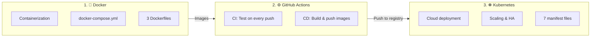
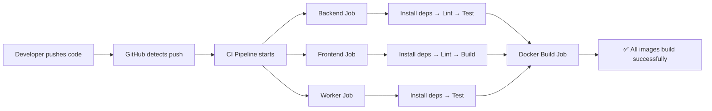
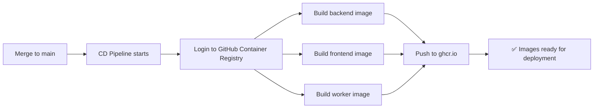
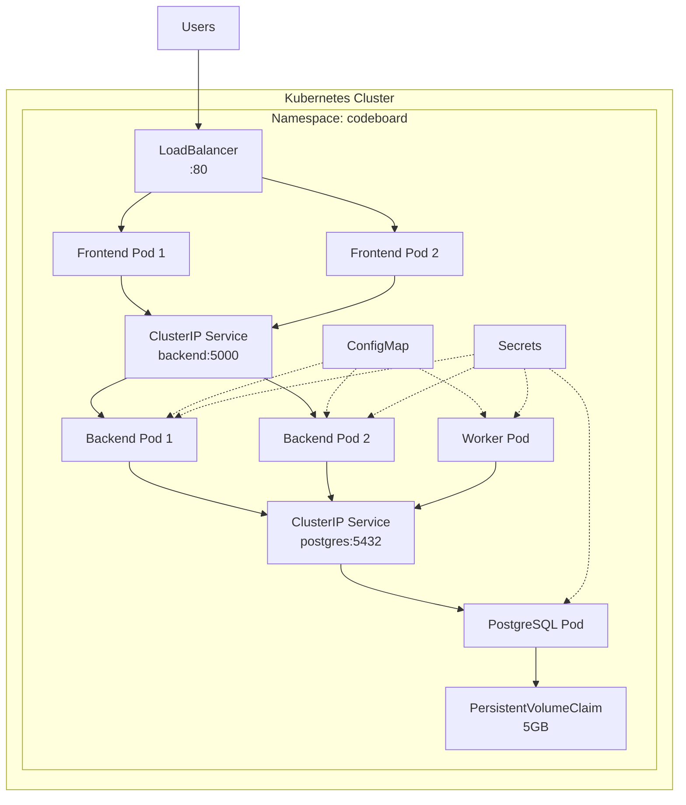

# 🎯 CodeBoard — DevOps Explained & How to Demo It

## The 3 DevOps Pillars in Your Project



---

## 1. 🐳 DOCKER — Containerization

### What is it?
Docker packages your app + all its dependencies into a **container** (like a lightweight virtual machine). This means your app runs **identically** on your laptop, your teammate's laptop, and in the cloud.

### Where is it in your project?

| File | What it does |
|------|-------------|
| [frontend/Dockerfile](file:///d:/Codeboard/frontend/Dockerfile) | Builds React → serves with Nginx |
| [backend/Dockerfile](file:///d:/Codeboard/backend/Dockerfile) | Runs Express API server |
| [worker/Dockerfile](file:///d:/Codeboard/worker/Dockerfile) | Runs background data fetcher |
| [docker-compose.yml](file:///d:/Codeboard/docker-compose.yml) | **Orchestrates all 4 containers** together |

### How each Dockerfile works:

**Frontend (Multi-stage build — most interesting!):**
```dockerfile
# Stage 1: Build the React app using Node.js
FROM node:20-alpine AS build
WORKDIR /app
COPY package*.json ./
RUN npm ci                    # Install dependencies
COPY . .
RUN npm run build             # Build production bundle
    
# Stage 2: Serve with Nginx (tiny image, ~30MB)
FROM nginx:alpine
COPY --from=build /app/dist /usr/share/nginx/html
COPY nginx.conf /etc/nginx/conf.d/default.conf
EXPOSE 80
```
> **Why multi-stage?** The Node.js image is ~300MB. By copying only the built files to Nginx, the final image is ~30MB. This is a **DevOps best practice**.

**Backend & Worker (Simple production images):**
```dockerfile
FROM node:20-alpine
WORKDIR /app
COPY package*.json ./
RUN npm ci --only=production   # Only production deps (no devDependencies)
COPY . .
USER node                      # Security: run as non-root user
CMD ["node", "src/index.js"]
```

### 🎤 How to DEMO Docker (show these commands live):

```bash
# 1. Show all running containers
docker ps

# 2. Show the images you built
docker images | findstr codeboard

# 3. Show container logs
docker logs codeboard-backend --tail 5
docker logs codeboard-worker --tail 5

# 4. Stop everything
docker-compose down

# 5. Start everything with ONE command
docker-compose up -d

# 6. Show it rebuilds automatically
docker-compose up --build -d
```

### Key points to mention in demo:
- ✅ **One command** (`docker-compose up`) starts 4 services
- ✅ **Health checks** — backend waits for PostgreSQL to be ready
- ✅ **Volumes** — database data persists even if containers restart
- ✅ **Network isolation** — containers talk via internal Docker network
- ✅ **Environment variables** — config is injected, not hardcoded

---

## 2. ⚙️ GITHUB ACTIONS — CI/CD Pipeline

### What is it?
**CI (Continuous Integration):** Every time you push code, GitHub automatically runs tests and builds to make sure nothing is broken.

**CD (Continuous Deployment):** When code is merged to `main`, GitHub automatically builds Docker images and pushes them to a registry.

### Where is it in your project?

| File | Trigger | What it does |
|------|---------|-------------|
| [.github/workflows/ci.yml](file:///d:/Codeboard/.github/workflows/ci.yml) | Every `push` or `PR` | Tests + Builds all services |
| [.github/workflows/cd.yml](file:///d:/Codeboard/.github/workflows/cd.yml) | Push to `main` | Builds & pushes Docker images to GHCR |

### CI Pipeline flow:


### CD Pipeline flow:


### 🎤 How to DEMO GitHub Actions:

**Step 1: Push the repo to GitHub**
```bash
# Create a repo on GitHub first (github.com/new), then:
cd d:\Codeboard
git remote add origin https://github.com/PriyanshiVishwakarma09/codeboard.git
git branch -M main
git push -u origin main
```

**Step 2: Show the Actions tab on GitHub**
- Go to `https://github.com/PriyanshiVishwakarma09/codeboard/actions`
- You'll see the CI pipeline running automatically!
- Show the jobs: Backend Test → Frontend Build → Worker Test → Docker Build

**Step 3: Trigger a pipeline manually**
```bash
# Make a small change and push
echo "# Updated" >> README.md
git add .
git commit -m "docs: update readme"
git push
```
- Go to GitHub Actions tab → Watch it run live!

**Step 4: Show what CI catches**
- If a test fails or build breaks, the pipeline shows ❌
- PRs can't be merged until CI passes (you can enable this in GitHub settings)

### Key points to mention in demo:
- ✅ **Automated testing** on every push
- ✅ **Parallel jobs** — backend, frontend, worker test simultaneously  
- ✅ **Docker image verification** — ensures images build correctly
- ✅ **CD pushes to GitHub Container Registry** (GHCR)
- ✅ **Zero manual intervention** — push code, everything runs automatically

---

## 3. ☸️ KUBERNETES — Cloud Deployment & Scaling

### What is it?
Kubernetes (K8s) is an **orchestrator for containers**. While Docker runs containers on a single machine, Kubernetes runs them **across multiple machines** with:
- **Auto-scaling** — add more replicas when traffic increases
- **Self-healing** — if a container dies, K8s restarts it
- **Load balancing** — distributes traffic across replicas
- **Zero-downtime deployments** — updates without shutting down

### Where is it in your project?

| File | K8s Resource | Purpose |
|------|-------------|---------|
| [k8s/namespace.yml](file:///d:/Codeboard/k8s/namespace.yml) | `Namespace` | Isolates CodeBoard in its own space |
| [k8s/configmap.yml](file:///d:/Codeboard/k8s/configmap.yml) | `ConfigMap` | Stores config like DB host, port |
| [k8s/secrets.yml](file:///d:/Codeboard/k8s/secrets.yml) | `Secret` | Stores passwords & tokens (encrypted) |
| [k8s/postgres.yml](file:///d:/Codeboard/k8s/postgres.yml) | `PVC + Deployment + Service` | Database with persistent storage |
| [k8s/backend.yml](file:///d:/Codeboard/k8s/backend.yml) | `Deployment (2 replicas) + Service` | API server with health checks |
| [k8s/worker.yml](file:///d:/Codeboard/k8s/worker.yml) | `Deployment (1 replica)` | Background worker |
| [k8s/frontend.yml](file:///d:/Codeboard/k8s/frontend.yml) | `Deployment (2 replicas) + LoadBalancer` | Public-facing frontend |

### Architecture in Kubernetes:


### 🎤 How to DEMO Kubernetes:

**Option A: Show the manifests and explain (easiest for presentation)**
```bash
# Show all K8s files
dir d:\Codeboard\k8s

# Walk through a key file
cat d:\Codeboard\k8s\backend.yml
```
Explain:
- `replicas: 2` → high availability
- `readinessProbe` → K8s checks if the pod is healthy before sending traffic
- `resources.limits` → prevents one service from eating all memory/CPU
- `Secret` references → passwords are never in the code

**Option B: Actually deploy to a local K8s cluster (Docker Desktop has one)**

```bash
# Enable Kubernetes in Docker Desktop settings, then:

# Apply all manifests in order
kubectl apply -f k8s/namespace.yml
kubectl apply -f k8s/configmap.yml
kubectl apply -f k8s/secrets.yml
kubectl apply -f k8s/postgres.yml
kubectl apply -f k8s/backend.yml
kubectl apply -f k8s/worker.yml
kubectl apply -f k8s/frontend.yml

# Show running pods
kubectl get pods -n codeboard

# Show services
kubectl get services -n codeboard

# Show how many replicas
kubectl get deployments -n codeboard

# Scale up the backend (LIVE SCALING DEMO!)
kubectl scale deployment backend -n codeboard --replicas=4
kubectl get pods -n codeboard   # Watch new pods appear!

# Scale back down
kubectl scale deployment backend -n codeboard --replicas=2
```

### Key points to mention:
- ✅ **2 replicas** for frontend and backend — if one crashes, the other handles traffic
- ✅ **Health checks** (readiness/liveness probes) — K8s auto-restarts unhealthy pods
- ✅ **PersistentVolumeClaim** — database data survives pod restarts
- ✅ **ConfigMap/Secrets** — config and passwords separated from code
- ✅ **LoadBalancer** — distributes traffic across frontend pods
- ✅ **Live scaling** — can scale from 2 to 100 pods with one command

---

## 📋 Demo Script (Presentation Order)

Use this order when presenting to someone:

### 1. Show the App First (2 min)
- Open `http://localhost` 
- Register, add usernames, click Sync Now
- Show the dashboard with real data

### 2. Docker (3 min)
```bash
docker ps                              # All 4 containers running
docker images | findstr codeboard      # Show built images
docker-compose down                    # Stop everything
docker-compose up -d                   # Start with one command
docker logs codeboard-backend --tail 5  # Show logs
```
Walk through `docker-compose.yml` — explain services, health checks, volumes

### 3. GitHub Actions (2 min)
- Show `.github/workflows/ci.yml` — explain the pipeline stages
- Push to GitHub → Show Actions tab running
- Explain: "Every push triggers lint → test → build automatically"

### 4. Kubernetes (3 min)
```bash
kubectl apply -f k8s/                   # Deploy everything
kubectl get pods -n codeboard           # Show running pods
kubectl get services -n codeboard       # Show services
kubectl scale deployment backend -n codeboard --replicas=4  # Live scaling!
kubectl get pods -n codeboard           # Watch pods appear
```
Walk through `k8s/backend.yml` — explain replicas, health probes, resource limits

### 5. Summary (1 min)
> "CodeBoard demonstrates real-world DevOps practices:
> - **Docker** containerizes each microservice
> - **GitHub Actions** automates testing and image building  
> - **Kubernetes** enables scalable, self-healing cloud deployment
> - Combined, this creates a complete CI/CD pipeline from code push to production"

---

## 🔧 Quick Setup for GitHub (Push your code)

```bash
cd d:\Codeboard

# 1. Create a repo on GitHub (go to github.com/new, name it "codeboard")

# 2. Connect and push
git remote add origin https://github.com/PriyanshiVishwakarma09/codeboard.git
git branch -M main
git push -u origin main

# 3. Go to https://github.com/PriyanshiVishwakarma09/codeboard/actions
#    Watch the CI pipeline run automatically!
```

> [!IMPORTANT]
> Replace `PriyanshiVishwakarma09` with your actual GitHub username in:
> - The git remote URL above
> - `k8s/backend.yml`, `k8s/worker.yml`, `k8s/frontend.yml` (image paths)
